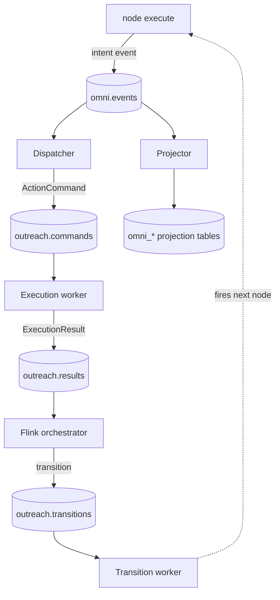
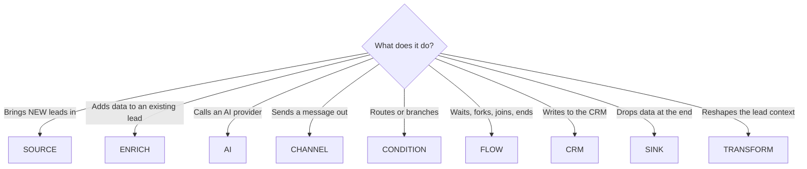

# Adding a node

A node is one capability operators wire onto the canvas: a lead source, an
enrichment step, an AI step, an outbound channel, a condition, a flow
primitive, a CRM mutation, or a sink. The registry auto-discovers nodes, so
adding one is a single Python file in `backend/app/nodes/<category>/`. No
router edits, no manual registration list.

For the common case — a REST integration — that one Python file is *all you
write*. A generic HTTP handler in the execution worker performs the request
your node declares. You only drop into Rust for the rare protocol the generic
handler can't express: stateful sessions, multi-step polling, multi-call
orchestration, non-HTTP transports, custom signing. **Section 9** is the
complete guide to writing one of those handlers.

## 1. How the repo fits together

The system is event-sourced. The log of record is a Redpanda topic,
`omni.events`; Postgres holds only projections derived from that log. A node
is a small, pure unit that the orchestrator runs as a lead moves through a
workflow.

| Component | Path | Role |
|---|---|---|
| FastAPI backend | `backend/app/` | HTTP API, auth, the node registry, routers. Where you add the node file. |
| Node registry | `backend/app/nodes/` | Auto-discovered node modules, one file per node, grouped by category. |
| Routers | `backend/app/routers/` | HTTP surface: canvas (workflows/nodes/edges), nodes (serves the registry + ad-hoc execute), projections (read API), events, integrations, ai_studio. |
| Event bus | `backend/app/services/bus.py` | Redpanda producer. Publishes to `omni.events` and `outreach.commands`, keyed by `workspace_id` / `lead_id`. |
| Dispatcher | `backend/app/execution/dispatcher.py` | Turns a node's intent event on `omni.events` into an `ActionCommand` on `outreach.commands`. |
| Execution worker | `backend-rust/src/handlers/` | Consumes `outreach.commands`, performs the real I/O per handler, emits results. Includes the generic `http_call` handler. |
| Flink orchestrator | `backend-flink/` | Consumes results, advances each lead through the DAG, emits transitions. |
| Transition worker | `backend/app/execution/transition_worker.py` | Walks the canvas edge on each transition, fires the next node, and handles the interior fan-out primitives (`flow.for_each` / `flow.join`). |
| Projector | `backend/app/projector/` | Consumes `omni.events` and upserts the `omni_*` projection tables the read API serves. |
| Frontend | `frontend/src/` | React + Vite + ReactFlow. `pages/CampaignEditor.tsx` reads `GET /nodes` and renders the palette and the auto-generated config form. |

## 2. The lifecycle of a node run

The Python node is a pure function: given context, it returns which output
handle the lead leaves on and (for side-effecting nodes) an intent event. The
dispatcher turns that intent into a command; the Rust execution worker
performs the I/O and returns a result; the Flink orchestrator advances the
lead, and the transition worker fires the next node.



A read-only node (a condition) has no worker hop: it picks a handle and the
orchestrator follows that edge. A side-effecting node is the full loop.

## 3. The four logical operations

The runtime composes a workflow from exactly four operations on streams of
entities. Every node is one of them.

| Operation | Cardinality | Examples |
|---|---|---|
| **produce** (1 → N at the start) | grow | sources (`source.csv`, `source.linkedin_jobs`) |
| **map / project** (1 → 1) | preserve | enrichments, channels, AI compose, CRM mutations |
| **filter** (1 → {0,1}) | shrink | conditions (`condition.field_match`), screen verdicts |
| **iterate / for-each** (1 → N *mid-graph*) | grow | `flow.for_each` (with `flow.join` as its barrier sibling) |

Until recently the runtime only had one cardinality-increasing primitive
(`produce`) and it was pinned to the start of the graph. `flow.for_each` adds
interior fan-out: a node *in the middle* of the graph can turn one entity
into many. That's what makes pipelines like "for each company → search →
screen each person" expressible as a real canvas graph instead of a hidden
Python loop. Section 8 covers fan-out in detail.

## 4. The contract

Every node module either:

- exports `MANIFEST: NodeManifest`, `async def execute(ctx) -> NodeResult`,
  and calls `register(MANIFEST, execute)` at module scope (the manual
  pattern), OR
- calls `http_node(...)` / `http_source_node(...)` at module scope (the
  declarative pattern, for plain REST integrations — `http_node` builds the
  manifest and registers internally; you don't write `execute`).

`discover()` (at startup) walks `app/nodes/<category>/*.py`, imports each
module, and each `register()` call adds it to the registry. The manifest is
served at `GET /nodes`, which the frontend palette reads live.

### NodeManifest fields

| Field | Type | Notes |
|---|---|---|
| `type` | `str` | Dotted, `<category>.<name>` (e.g. `source.serper`). Globally unique — a duplicate raises at startup. |
| `category` | `NodeCategory` | `SOURCE`, `ENRICH`, `AI`, `CHANNEL`, `CONDITION`, `FLOW`, `CRM`, `SINK`, `TRANSFORM`. Drives palette grouping and node color. |
| `summary` | `str` | One line shown on the node card and palette tooltip. |
| `config_schema` | `type[BaseModel]` | A Pydantic model. Its JSON Schema renders the config form automatically (section 6). |
| `output_handles` | `tuple[NodeHandle, ...]` | The named outgoing edges. Default `(NodeHandle("default"),)`. Empty tuple `()` = terminal node. |
| `capabilities` | `tuple[str, ...]` | Free-form tags, e.g. `("connection:serper",)`. |
| `side_effect` | `SideEffect` | `READ`, `NETWORK`, or `MUTATE`. |
| `icon` | `str` | Lucide icon hint (kebab-case). |

### NodeContext / NodeResult

```python
# input
ctx.workspace_id   ctx.workflow_id   ctx.node_id
ctx.config         # the operator's saved config for this node
ctx.lead           # the lead/contact context, includes custom_fields
ctx.correlation_id # thread this through events for tracing

# output
NodeResult(handle="default", events=[...], telemetry={...}, error=None)
```

The handle you return must be one of the manifest's `output_handles`.

## 5. Side effects: declare intent, don't do I/O in the node

A source node does not call the provider from Python. It declares the
request; the execution worker performs it (it holds connection pooling, proxy
rotation, and one-shot credential redemption). The node stays pure and
testable.

The secret (API key) is never in node config or the request. The node names a
connection; the worker redeems the key from that connection's credential
bundle at call time. See Section 9.4 for the credential dance.

## 6. The config form is automatic

`NodeConfigPanel` reads `config_schema.model_json_schema()` and renders inputs:

- `str` → text (long-named fields or `maxLength > 200` → textarea); `int` /
  `float` → number; `bool` → checkbox; `Literal` / `enum` → select
- `field: T | None` → optional; `field: T` → required (*)
- `Field(default=...)` → placeholder; `Field(description=...)` → helper text

Model the config well and the UI follows.

## 7. Picking the right category

The category is decided by one question: what does the node do to the lead?



## 8. The interior fan-out primitive: `flow.for_each` + `flow.join`

When a node produces a collection that the next step has to process **one
item at a time**, that's the iterate operation. The pattern uses two flow
nodes — one to fan out, one to barrier-join.

### How it works

1. An upstream node writes a collection to the lead's `custom_fields[items_key]`
   (e.g. a Serper search writes `people: [...]`).
2. The lead reaches `flow.for_each`. The transition worker reads the
   collection and **spawns one child lead per element**, with
   `parent_lead_id` + `origin_node_id` lineage. The parent parks at the
   for_each node with `fanout_total = len(items)`.
3. Each child walks the `each` edge independently, runs the body subgraph,
   and lands at the matching `flow.join`.
4. When a child arrives at `flow.join`, it ends (`status=completed`) and the
   parent's `fanout_done` counter is bumped atomically.
5. When `fanout_done == fanout_total`, the parent is released down the
   for_each's `done` edge as a single entity again.

Empty collection → the parent skips to `done`/`empty` immediately (no
children spawned).

### Worked example: per-company person search

```
[source.linkedin_jobs] (writes companies[])
        │ default
        ▼
[flow.for_each(items_key=companies, item_field=item)]
        │ each
        ▼
[condition.company_filter(company_field=item)]
        │ default      │ rejected → leaf
        ▼
[ai.screen_company(company_field=item)]      ← fail-open via on_error_handle
        │ accept       │ reject → leaf
        ▼
[source.serper_people(company_field=item)]   ← writes people[]
        │ default
        ▼
[flow.for_each(items_key=people, item_field=item)]
        │ each
        ▼
[ai.screen_person(person_field=item)]        ← fail-closed via on_error_handle
        │ accept       │ reject → leaf
        ▼
[crm.create_contact]
        ▼
[flow.join]   ← people barrier (innermost)
        ▼
[flow.join]   ← companies barrier (outermost)
        ▼
[end]
```

Two nested `for_each`/`join` pairs. The lineage columns on `omni_leads` carry
the parent-of-parent relationship.

### `lead_mutations`: how a source handler hands data to the next node

A source handler doesn't just emit a result — it writes data back to the
lead. When `source.linkedin_jobs` finishes, the muscle returns:

```json
{
  "status": "sent",
  "lead_mutations": {"custom_fields": {"companies": [...]}},
  "metadata": {"next_handle": "default"}
}
```

The Flink orchestrator forwards `lead_mutations` into the transition envelope.
The transition worker merges it into `omni_leads.custom_fields` (jsonb `||`)
*before* firing the next node. The downstream `flow.for_each(items_key=companies)`
reads the freshly merged collection.

The contract is conservative: only `custom_fields` jsonb merge is honored
today. Top-level lead column updates require an explicit branch in
`_apply_lead_mutations` — the muscle is not trusted to name DB schema.

## 9. Writing a bespoke Rust handler — the complete guide

This is a mini-guide on its own. Read it end-to-end if you've decided you
need Rust.

### 9.1 The rule for when you need one

> Can the integration be expressed as **one HTTP request → read one field
> out of the JSON response**?
> - **Yes** → no Rust. Use `http_node` (one Python file, like `source.serper`).
> - **No** → write a bespoke Rust handler + add a `ChannelType` variant.

You **must** write a bespoke handler when the call needs any of these:

1. **A session or handshake** — SMTP (`channel.email`), IMAP, anything
   stateful. Not one request / response.
2. **A non-HTTP transport** — raw TCP, gRPC, WebSocket, a vendor binary SDK.
3. **A provider SDK with its own signing/session logic** — Unipile, Twilio,
   Retell, signed Stripe webhooks.
4. **Multiple chained calls in one node** — paginate then hydrate each result
   with a second call; or POST run + poll status + GET dataset (Apify); or
   loop "2 patterns × N titles" with dedup (Serper-people). A single
   `HttpRequest` can't loop.
5. **Streaming / long-poll / chunked responses** consumed incrementally.
6. **Auth beyond bearer or api-key-header** — OAuth refresh dances, HMAC
   request signing, mTLS.
7. **Internal mutations the worker owns** — `crm.add_tag`, `ai.enrich`, etc.,
   which act on workspace state rather than calling out.

If none of the above apply, the declarative `http_node` is faster and safer.

### 9.2 The 4-file wiring

Adding a bespoke handler is always exactly four edits plus one new file (and
one optional Python enum mirror):

| File | Edit |
|---|---|
| `backend-rust/src/models.rs` | Add a variant to the `ChannelType` enum + its `as_str` arm. |
| `backend-rust/src/handlers/<name>.rs` | **New file.** The handler itself. |
| `backend-rust/src/handlers/mod.rs` | `pub mod <name>;` declaration + add an arm to `dispatch()`. |
| `backend/app/execution/commands.py` | `NODE_CHANNEL["<node.type>"] = ChannelType.<NEW>` so the dispatcher routes intent → command. |
| `backend/app/core/events.py` | Mirror the new value on the Python `ChannelType` enum (string must match the Rust `serde(rename=...)`). |

That's it. No router edits, no scheduler edits, no migration unless the node
also stores a new entity.

### 9.3 The handler skeleton

Every handler is one `async fn` taking an `ActionCommand` and returning an
`ExecutionResult`. The result envelope shape is fixed; you build it with
helpers from `handlers/common.rs`.

```rust
//! handlers/my_provider.rs

use crate::credentials;
use crate::handlers::common;
use crate::http::OUTBOUND;  // or WEBHOOK for operator-supplied URLs
use crate::models::{ActionCommand, ExecutionResult};
use serde_json::{json, Value};

pub async fn handle_my_provider(command: &ActionCommand) -> ExecutionResult {
    // 1. Validate inputs (fail fast — non-retriable).
    let user_id = common::s(command, "user_id");
    if user_id.is_empty() {
        return common::fail(command, "MY_PROVIDER_USER_ID_MISSING", false);
    }

    // 2. Redeem the credential. Held in memory for this call only.
    let cred_ref = command.credential_ref.clone();
    let api_key = match &cred_ref {
        Some(r) if !r.is_empty() => match credentials::redeem_field(r, "api_key").await {
            Ok(Some(k)) => k,
            Ok(None) => return common::fail(command, "MY_PROVIDER_NO_API_KEY", false),
            Err(e) => return common::fail(command, format!("MY_PROVIDER_CRED_{e}"), true),
        },
        _ => return common::fail(command, "MY_PROVIDER_CRED_MISSING", false),
    };

    // 3. Do the I/O.
    let resp = OUTBOUND
        .post("https://api.example.com/v1/things")
        .bearer_auth(&api_key)
        .json(&json!({"user_id": user_id}))
        .send()
        .await;

    // 4. Release the one-shot credential — every code path must release it.
    if let Some(r) = &cred_ref { credentials::release(r).await; }

    // 5. Map the response to handle + result.
    match resp {
        Ok(r) if r.status().is_success() => {
            let body: Value = r.json().await.unwrap_or(Value::Null);
            let mut result = common::ok(
                command,
                json!({"status": 200, "items": body["items"].as_array().map(|a| a.len())}),
                Some("my_provider.completed"),  // event_type, mirrored to omni.events
                json!({}),                       // lead_mutations
            );
            result.metadata.insert("next_handle".to_string(), json!("default"));
            result
        }
        Ok(r) => {
            let status = r.status();
            let retriable = status.is_server_error() || status.as_u16() == 429;
            common::fail(command, format!("MY_PROVIDER_HTTP_{}", status.as_u16()), retriable)
        }
        Err(e) => {
            tracing::warn!(error = %e, "my_provider network failure");
            common::fail(command, "MY_PROVIDER_NETWORK_ERROR", true)
        }
    }
}
```

That skeleton is the spine of every handler in the tree. Read it once.

### 9.4 The credential dance (one-shot redemption)

The control plane (`backend/app/routers/credentials.py`) issues an opaque
`credential_ref` when the dispatcher builds the command — the plaintext key
never travels in Kafka. The muscle redeems the ref exactly once:

```rust
let api_key = credentials::redeem_field(cred_ref, "api_key").await?;
```

After the I/O (success, failure, or rate-limit) **the handler must call
`credentials::release(cred_ref)`** so the control plane invalidates the
one-shot token. Forgetting `release()` means the token lingers in
`omni_credential_refs` until its TTL expires — not catastrophic, but
sloppy. The pattern in 9.3 calls release before the match because every
match arm exits without further redemption.

Fields available on the bundle depend on the connection type (set in
`omni_connections.credentials_encrypted`):
- `api_key` — most providers
- `smtp_user` + `smtp_password` — email
- `auth_token` + `refresh_token` — OAuth providers
- arbitrary keys — define your own and Pydantic-validate them in the
  control-plane connection setup

Use `credentials::redeem(ref)` (returns the whole `Value`) when you need
multiple fields; use `redeem_field(ref, "name")` for one.

### 9.5 The response envelope

`common::ok` / `common::fail` / `common::skipped` / `common::rate_limited`
are the four builders. Every handler must return one of them.

| Builder | When | TaskStatus | is_retriable |
|---|---|---|---|
| `ok(command, telemetry, event_type, lead_mutations)` | I/O succeeded | `Sent` | `false` |
| `fail(command, code, retriable)` | I/O failed permanently OR transient | `Failed` | caller decides |
| `skipped(command, reason)` | Ran to completion but no side effect (e.g. precondition not met) | `Skipped` | `false` |
| `rate_limited(command, reason)` | Provider returned 429 / quota | `RateLimited` | `true` |

**Crucial: `metadata.next_handle`**. The Flink orchestrator reads this to
pick which outgoing edge of the canvas node to walk. If you don't set it, the
default is `"default"`. To branch a node into multiple paths (success vs.
empty vs. on_error), set it explicitly:

```rust
result.metadata.insert("next_handle".to_string(), json!("empty"));
```

**`event_type`** on a successful result is mirrored into `omni.events` by
the projector so the activity log shows what happened. Use kebab-snake names
that match the node type: `source.linkedin_jobs.completed`, `email.sent`,
`crm.tag_added`.

**`lead_mutations`** is the data-passing channel (Section 8). Today only
`{custom_fields: {key: value}}` is honored — those keys jsonb-merge onto the
lead before the next node fires.

### 9.6 Worked example A — multi-step poll (Apify)

The Apify actor needs three calls: POST a run, poll status every 5s until
terminal, then GET the dataset. The full file is
`backend-rust/src/handlers/apify.rs`. The shape:

```rust
pub async fn handle_apify(command: &ActionCommand) -> ExecutionResult {
    // ... parse + validate payload ...
    let api_key = /* redeem */;

    // 1. Start the run.
    let start_resp = WEBHOOK.post(&start_url).json(&body).send().await;
    let (run_id, dataset_id) = match start_resp { /* extract or fail */ };

    // 2. Poll until terminal. Bounded loop = the cap.
    let mut terminal = String::new();
    for _ in 0..MAX_POLL_ATTEMPTS {  // 120 × 5s = 10 min
        tokio::time::sleep(Duration::from_secs(POLL_INTERVAL_SECONDS)).await;
        match WEBHOOK.get(&status_url).send().await {
            Ok(r) if r.status().is_success() => {
                let status = r.json::<Value>().await.unwrap_or_default()
                    ["data"]["status"].as_str().unwrap_or("").to_string();
                if status == "SUCCEEDED" { terminal = status; break; }
                if matches!(status.as_str(), "FAILED" | "ABORTED" | "TIMED-OUT") {
                    credentials::release(cred_ref).await;
                    return common::fail(command, format!("APIFY_RUN_{status}"), false);
                }
            }
            _ => { /* network blip — log and continue */ }
        }
    }
    if terminal != "SUCCEEDED" {
        credentials::release(cred_ref).await;
        return common::fail(command, "APIFY_RUN_TIMEOUT", true);
    }

    // 3. Fetch dataset.
    let items: Vec<Value> = /* GET /datasets/{id}/items */;
    credentials::release(cred_ref).await;

    // 4. Dedupe + extract.
    let companies = extract_companies(&items);

    // 5. Hand the collection to the next node via lead_mutations.
    let mutations = json!({"custom_fields": {companies_key: companies}});
    let mut result = common::ok(
        command,
        json!({"jobs_returned": items.len(), "companies_extracted": companies.len()}),
        Some("source.linkedin_jobs.completed"),
        mutations,
    );
    result.metadata.insert("next_handle".to_string(),
        json!(if companies.is_empty() { "empty" } else { "default" }));
    result
}
```

Three things to notice:

- **Bounded poll loop.** Never `loop {}`. Always cap with a constant so a
  stuck provider can't pin a worker thread forever.
- **`tokio::time::sleep`, never `std::thread::sleep`.** `std::thread::sleep`
  blocks the runtime; `tokio::time::sleep` yields it so other commands can
  proceed in parallel.
- **`release` is called on every exit path.** The early `FAILED` branch and
  the timeout branch both call it before returning.

### 9.7 Worked example B — asymmetric error policy (AI screen)

`ai.screen_company` and `ai.screen_person` both call Anthropic but want
**different behaviour on failure**: company-screen fails *open* (LLM flakes
shouldn't lose valid companies), person-screen fails *closed* (volume is
high, false positives are expensive). One handler, two policies — the
asymmetry lives in the node's payload, not the Rust code.

```rust
let on_error_handle = {
    let h = common::s(command, "on_error_handle");
    if matches!(h.as_str(), "accept" | "reject") { h } else { "reject".into() }
};

// ... call Anthropic ...

// On error: a Skipped result that still routes to the configured handle.
fn error_path(
    command: &ActionCommand,
    code: impl Into<String>,
    on_error_handle: &str,
) -> ExecutionResult {
    let mut result = common::skipped(command, code.into());
    result.metadata.insert("next_handle".to_string(), json!(on_error_handle));
    result
}
```

The node sets `payload.on_error_handle = "accept"` for the company variant
and `"reject"` for the person variant. The handler reads it and the
orchestrator follows. Adding a third variant later is a new node + new
payload value; no handler change.

### 9.8 The HTTP client pools

Two shared `reqwest::Client` instances live in `backend-rust/src/http.rs`:

| Pool | Timeout | Redirects | Use for |
|---|---|---|---|
| `OUTBOUND` | 30s | default | provider-controlled URLs (Anthropic, Apify, Twilio, Unipile, Serper) |
| `WEBHOOK` | 15s | max 3 | **operator-supplied** URLs (webhook_out, http_call, anything the operator types into a config field) |

The `WEBHOOK` pool is stricter because an operator can paste any URL — a
hung host shouldn't starve the worker. **Always** pair `WEBHOOK` with the
SSRF guard in `common::validate_outbound_url` to reject loopback, RFC-1918,
cloud metadata, and link-local addresses:

```rust
if let Err(code) = common::validate_outbound_url(&url) {
    return common::fail(command, format!("MY_HANDLER_{code}"), false);
}
```

### 9.9 Errors: retriable vs. non-retriable

The `is_retriable` flag on `common::fail` determines what Flink does next:

- `false` → emit a transition on the **`on_error`** handle so the workflow
  branches into the operator's fallback (or drops the lead if no edge wired).
- `true` → Flink parks a short-delay timer and the muscle redrives the same
  command (idempotent at-least-once semantics; your handler must be safe on
  duplicates).

A reasonable rule:

| Failure kind | Retriable? |
|---|---|
| `4xx` from provider (bad request, auth, validation) | `false` |
| `429` rate-limit | use `common::rate_limited` (which sets `true`) |
| `5xx` from provider | `true` |
| Network/timeout/connection-reset | `true` |
| Credential redeem failed (network) | `true` |
| Credential redeem returned `None` (missing field) | `false` |
| Your own input validation failed | `false` |

### 9.10 Anti-patterns

Things that look reasonable but break the muscle's guarantees:

1. **`std::thread::sleep`** — blocks the tokio runtime; every concurrent
   command on the same worker stalls. Use `tokio::time::sleep`.
2. **Holding a DB transaction across an I/O call** — the muscle doesn't
   touch Postgres at all. If you think you need to, you're writing the wrong
   thing; surface the mutation via `lead_mutations` and let the transition
   worker apply it.
3. **Mutating shared global state** — handlers must be reentrant. Two
   commands can run concurrently for the same lead during retry storms.
4. **Logging secrets** — never `tracing::info!("key={api_key}")`. The
   `credentials::redeem*` functions don't log values; keep it that way.
5. **Unbounded retries inside the handler** — let Flink retry by returning
   `is_retriable: true`. A retry loop inside the handler hides backoff from
   the orchestrator and can pile up requests against a rate-limited
   provider.
6. **Forgetting to set `next_handle`** — if your node has more than one
   outgoing edge, omitting `next_handle` silently routes everything down
   `default`. Operators see "the branch never fires."
7. **Writing to columns other than `custom_fields` via `lead_mutations`** —
   the transition worker only merges `custom_fields`. Other keys are
   ignored. For top-level column updates, extend `_apply_lead_mutations` in
   `transition_worker.py` with an explicit branch.
8. **Calling `release()` more than once** — idempotent on the control plane
   side but unnecessary work. Call it once per command.

## 10. Other patterns

### Condition node (branching, no I/O)

A non-HTTP node uses the plain registry directly:

```python
async def execute(ctx: NodeContext) -> NodeResult:
    cfg = HasTagConfig(**ctx.config)
    has = cfg.tag in (ctx.lead.get("tags") or [])
    return NodeResult(
        handle="true" if has else "false",
        telemetry={"tag": cfg.tag, "matched": has},
    )
```

with `output_handles=(NodeHandle("true", ...), NodeHandle("false", ...))`.

### The `HttpRequest` contract (declarative path)

`http_node` / `http_source_node` take a `build_request(ctx) -> HttpRequest`:

| Field | Notes |
|---|---|
| `url` | Full URL (token-substitute `{{lead.*}}` in `build_request` if needed). |
| `method` | `"GET"` default. |
| `headers` / `query` | Static `{name: value}` maps. |
| `body` | JSON body for non-GET. |
| `auth` | `{"mode":"none"}` / `{"mode":"bearer"}` / `{"mode":"api_key_header","header":"X-API-KEY","prefix":""}`. The key comes from the connection bundle, never config. |
| `result_path` | Dotted path to the result set. Non-empty → `default`; empty/missing → `empty`. Omit to always take `default` on 2xx. |

The worker maps HTTP status to handles: 2xx → `default`/`empty` per
`result_path`; non-2xx → `on_error` (retriable on 5xx/429).

### Handle naming conventions

The frontend colors handles by name:

- success / continue render green: `default`, `sent`, `placed`, `true`,
  `variant_a` … `variant_d`, `approved`, `accept`, `each`, `done`
- error / negative / dead-end render red: `on_error`, `false`, `empty`,
  `rejected`, `reject`, `timeout`

Use these names so operators get the right visual cue for free. A terminal
node (`flow.end`) uses `output_handles=()` and renders with no source handle.

### When you need a projector handler

If your node's worker emits an event whose `entity_type` is not already
projected, add a handler. The projector
(`backend/app/projector/main.py`) dispatches by `entity_type`:

```python
_PROJECTORS = {
    "contact": _project_contact,
    "company": _project_company,
    "deal":    _project_deal,
    "lead":    _project_lead,
}
```

with special cases for `message.*` and `ai.*`. To project a new entity:
write `async def _project_<thing>(env)` that upserts into the `omni_*` table
(qualify columns with the full table name in `ON CONFLICT ... DO UPDATE` — a
bare alias raises "missing FROM-clause entry"), add it to `_PROJECTORS`, and
add a migration with RLS (see `022_omni_ai.py`).

## 11. Worked example — declarative path (one Python file)

Goal: a node that searches Google via Serper and pulls the result pages as
leads — e.g. `"VP Engineering" fintech London site:linkedin.com/in` to
surface decision-maker profiles. It brings new leads into the workflow, so
it's a SOURCE node. Because Serper is a plain REST API (POST a query, get
JSON back), it needs no Rust.

This is the real `backend/app/nodes/sources/serper.py`:

```python
class SerperSourceConfig(BaseModel):
    connection_name: str = Field(description="Serper connection (Settings -> Integrations)")
    query: str = Field(min_length=1, description="e.g. 'VP Engineering fintech London'")
    num: int = Field(10, ge=1, le=100, description="Max results to pull per run")
    gl: str | None = Field(None, description="Country code, e.g. 'us', 'gb'")


def build_request(ctx: NodeContext) -> HttpRequest:
    cfg = SerperSourceConfig(**ctx.config)
    body = {"q": cfg.query, "num": cfg.num}
    if cfg.gl:
        body["gl"] = cfg.gl
    return HttpRequest(
        method="POST",
        url="https://google.serper.dev/search",
        auth={"mode": "api_key_header", "header": "X-API-KEY"},
        body=body,
        result_path="organic",  # response.organic[] -> "default", [] -> "empty"
    )


http_source_node(
    type="source.serper",
    summary="Search Google via Serper and pull result pages as leads",
    config_schema=SerperSourceConfig,
    build_request=build_request,
    capabilities=("connection:serper",),
    icon="search",
)
```

That is the whole node. It appears in the palette under SOURCE immediately.

How it runs (no code you write): the node emits an `http_call.requested`
intent → the dispatcher builds an `ActionCommand` (channel `http_call`) and
mints a one-shot credential ref from the `serper` connection → the generic
`http_call` worker performs the POST with the `X-API-KEY` header, applies the
SSRF guard, and maps the response: non-empty `organic[]` → the `default`
handle, empty → `empty`, error → `on_error`.

## 12. Frontend icon (optional)

The palette falls back to the category icon. To give a node a distinct
glyph, add an entry to `NODE_TYPE_ICON` in
`frontend/src/pages/CampaignEditor.tsx`:

```ts
'source.serper': Search,
```

(Import the icon from `lucide-react` at the top of the file.)

## 13. Verify and deploy

```bash
# Node file compiles + registers (prints whether it's present)
python -m py_compile backend/app/nodes/sources/serper.py
cd backend && python -c "import app.nodes as n; n.discover(); \
  print('source.serper' in {m.type for m in n.manifests()})"
```

A pure-Python node (declarative HTTP or condition/flow) ships with just the
backend image. **Only a bespoke Rust handler needs the worker rebuilt.**

```bash
# Pure-Python node:
docker compose -p omni-v2 -f docker-compose.v2.yml up -d --build backend-v2

# Bespoke Rust handler — rebuild the muscle too:
docker compose -p omni-v2 -f docker-compose.v2.yml up -d --build backend-v2 muscle-v2

# If you added a migration:
docker compose -p omni-v2 -f docker-compose.v2.yml exec backend-v2 alembic upgrade head
```

Confirm live (the palette reads `GET /nodes` on next load):

```bash
curl -sk https://<host>/api/nodes -H "Authorization: Bearer $TOKEN" \
  | python -c "import sys, json; print(len(json.load(sys.stdin)), 'nodes')"
```

## 14. Checklist

- [ ] One file in `backend/app/nodes/<category>/<name>.py`
- [ ] **REST integration** → use `http_node` / `http_source_node`; declare
      the request, done
- [ ] **Other Python nodes** → `MANIFEST`, `execute`, `register(MANIFEST, execute)`
- [ ] **Bespoke Rust handler** → `ChannelType` variant + `handlers/<name>.rs`
      + `handlers/mod.rs` route + Python `NODE_CHANNEL` mapping + Python
      `ChannelType` mirror (Section 9.2)
- [ ] `type` is unique and dotted `<category>.<name>`
- [ ] Config is a Pydantic model with `Field(description=...)` on each field
- [ ] Secret comes from a named connection, never from config
- [ ] `execute` / response mapping returns a handle that exists in
      `output_handles`
- [ ] If the node produces a collection downstream consumes, write it via
      `lead_mutations.custom_fields[key]` and pair with `flow.for_each`
- [ ] On-error policy is in node payload (`on_error_handle`), not hard-coded
      in the handler
- [ ] Bespoke handler calls `credentials::release` on every exit path
- [ ] Bespoke handler uses `tokio::time::sleep`, bounded loops, no shared
      mutable state
- [ ] If new entity → projector handler + migration with RLS
- [ ] Compiles, registers, deployed, visible in `GET /nodes`
