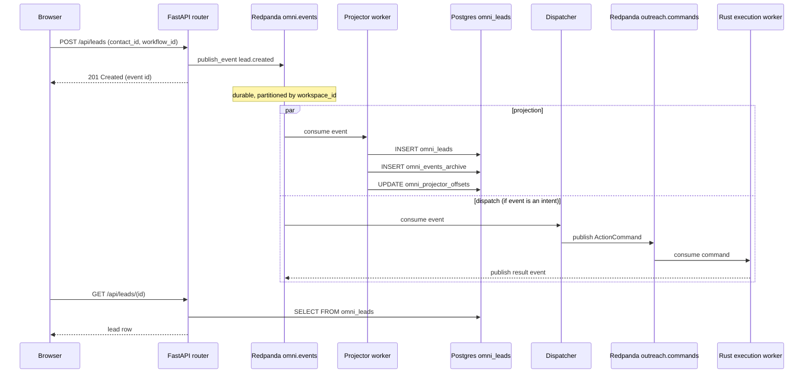
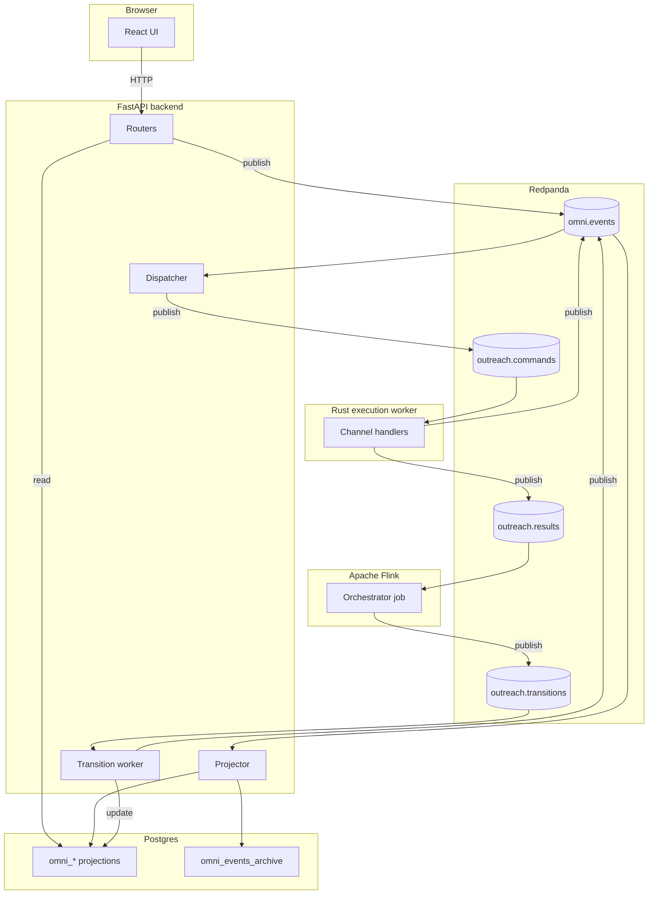

# How Omni stores data

A working guide to the database side of the system: what's in Postgres,
what's in Redpanda, why both, how they're connected, and what the code
actually does. Written for someone who hasn't worked with event streaming
before. Every claim is grounded in real files and line numbers.

## 1. The one-paragraph picture

There are two stores. **Redpanda** holds an append-only log called
`omni.events` — every fact about every workspace, in order, forever. **Postgres**
holds a set of tables named `omni_contacts`, `omni_leads`, `omni_deals`, etc.,
which are *materialized views* of that log: a small worker process reads each
event off Redpanda and updates the matching row. Postgres is the **query
surface** (the frontend reads from it via FastAPI). Redpanda is the **source of
truth** (every row in Postgres can be rebuilt from it).

It's the same shape as an accountant's ledger and the bank statement at the top
of an account. The ledger is the truth — entry-by-entry, never edited. The
statement is what you read when you want to know the balance.

## 2. Why two stores instead of one

> "Why not just write everything to Postgres directly?"

A traditional CRUD app overwrites. When a lead's status changes from `active`
to `replied`, the old value is gone. If you want to know *when* it changed,
*who* changed it, or what the value was last Tuesday, you can't. You either
add audit-log tables (and remember to write to them) or you lose the history.

The log-first design flips it: every change is **first** recorded as an
immutable event (`lead.status_changed`), and the row in `omni_leads` is
recomputed *from* that event. The row is a convenience for fast reads. The
event is the truth.

That buys you four things you can't easily retrofit:

1. **A complete audit trail by construction.** Every change is logged because
   every change *is* a logged event. There's no "did the developer remember to
   add an audit row?" question.
2. **Replay.** If a projection is buggy — say `omni_leads.status` got the wrong
   value because of a release that's now reverted — you fix the projector and
   replay from offset zero. Postgres gets rebuilt. The truth was never lost.
3. **Independent readers.** New consumers (analytics, search index, a webhook
   to a customer's CRM, an audit-log dashboard) can subscribe to the *same*
   `omni.events` stream without touching Postgres or risking a query that locks
   the leads table. The projector is just one consumer of many.
4. **Loose coupling.** The Python control plane, the Rust execution worker,
   the Flink orchestrator, and the projector all live behind topic boundaries.
   None of them call each other directly. Any can be redeployed without the
   others.

This pattern has names — **event sourcing** for the log-of-truth idea,
**CQRS** (Command Query Responsibility Segregation) for the
"write-to-log, read-from-projections" split. They were invented because
projects that grew beyond ~10 engineers kept hitting the same walls with
overwrite-only databases: lost history, race conditions when two services
wrote the same row, audit logs that drifted from reality, and brittle
integration with downstream systems. Omni adopts the pattern from day one
so we don't have to retrofit it later.

## 3. What is Redpanda, exactly?

Redpanda is **Kafka**, rewritten in C++ to be a single binary with no JVM,
no ZooKeeper, and faster startup. Wire-compatible with Kafka, so every
Kafka client library works against it unchanged. We picked Redpanda because
the operational footprint is one container instead of three.

Mental model:

- A **topic** is an append-only file (logically). Producers append, consumers
  read positions ("offsets") forward.
- A topic is split into **partitions** for parallelism. Each partition is
  strictly ordered; across partitions, order is not guaranteed.
- A **consumer group** is a set of consumers that split the partitions among
  themselves. If one consumer dies, its partitions are reassigned to the
  others. Each consumer remembers where it left off (its offset) so a restart
  resumes cleanly.
- A **key** on a message decides which partition it lands on (hash of key →
  partition number). All messages with the same key go to the same partition
  → strictly ordered relative to each other.

In Omni: messages are keyed by `workspace_id` for `omni.events` and by
`lead_id` for `outreach.commands`. That guarantees ordering inside a tenant
and inside a lead's journey, while still letting different tenants/leads
proceed in parallel.

## 4. The five topics

| Topic | Purpose | Key | Producer | Consumer(s) |
|---|---|---|---|---|
| `omni.events` | **Durable log of record.** Every fact about every workspace. Never truncated past retention. | `workspace_id` | FastAPI routers (user actions), nodes (intent), Rust execution worker (results mirrored back) | Projector (→ Postgres), dispatcher (→ commands) |
| `outreach.commands` | In-flight work orders for the Rust execution worker. Drops out of the log once acked. | `lead_id` | Dispatcher | Rust execution worker |
| `outreach.results` | In-flight receipts from the Rust execution worker. | `lead_id` | Rust execution worker | Flink orchestrator |
| `outreach.transitions` | DAG advancement signals — "this lead should move to that node now." | `lead_id` | Flink orchestrator | Transition worker |
| (control-plane heartbeat topics — not user-relevant) | health, lag exporters | — | — | — |

The names follow a deliberate split. **`omni.events`** is the *durable* log:
the historical record. **`outreach.*`** are *operational* topics: queues for
work in flight, with short retention.

> Constants are defined in `backend/app/services/bus.py:27-30`:
>
>     EVENTS_TOPIC = "omni.events"
>     COMMANDS_TOPIC = "outreach.commands"
>     RESULTS_TOPIC = "outreach.results"
>     TRANSITIONS_TOPIC = "outreach.transitions"

## 5. What is in Postgres

Postgres is **not** the source of truth. It is the read API's substrate. Five
groups of tables live there.

### 5.1 Projection tables — the rows the frontend reads

Maintained by the projector worker from `omni.events`. Every column was
written by an event handler. They can be dropped and rebuilt from the log
at any time.

| Table | One row per | Maintained from |
|---|---|---|
| `omni_contacts` | A person we've heard of (email, LinkedIn URL, name, company) | `contact.created`, `contact.updated`, `contact.enriched` |
| `omni_companies` | A company we've heard of | `company.*` events |
| `omni_deals` | A sales-pipeline deal | `deal.*` events |
| `omni_leads` | A contact's journey through one workflow (status, which node they're on, fanout counters) | `lead.created`, `lead.advanced`, `lead.status_changed`, transition-worker writes |
| `omni_messages` | An inbound/outbound message (email, DM, SMS) | `message.received`, `message.sent` |
| `omni_lead_scores` | ICP/fit score per lead | `ai.score.completed` |
| `omni_ai_jobs` | One row per AI run (compose, classify, score, enrich) | `ai.*.queued`, `ai.*.completed`, `ai.*.failed` |

Schema defined in `backend/alembic/versions/021_omni_v2.py` and
`022_omni_ai.py`.

### 5.2 Canvas tables — workflow definitions

These are *configuration*, not projections of events. The operator edits a
workflow in the canvas editor and a `PUT /api/canvas/...` request inserts the
rows directly.

- `omni_workflows` — one row per workflow
- `omni_workflow_nodes` — one row per node placed on the canvas
- `omni_workflow_edges` — one row per connection drawn between nodes

The transition worker reads these to walk a lead's path through the DAG.

### 5.3 Connections — encrypted credentials

`omni_connections` stores integration credentials (SMTP passwords, Anthropic
API keys, Unipile tokens, Apify keys). The `credentials_encrypted` column is
AES-encrypted at rest. Nodes refer to a connection *by name*; the dispatcher
mints a one-shot reference at command time and the Rust worker redeems it.
The plaintext never travels in Kafka.

### 5.4 `omni_events_archive` — every event also indexed for SQL

Every event the projector consumes is **also** inserted into this table:

```sql
CREATE TABLE omni_events_archive (
    id              UUID PRIMARY KEY,
    workspace_id    UUID NOT NULL,
    event_type      TEXT NOT NULL,
    entity_type     TEXT NOT NULL,
    entity_id       UUID,
    payload         JSONB NOT NULL,
    actor_user_id   UUID,
    correlation_id  UUID,
    kafka_topic     TEXT NOT NULL,
    kafka_partition INTEGER NOT NULL,
    kafka_offset    BIGINT NOT NULL,
    occurred_at     TIMESTAMPTZ NOT NULL,
    archived_at     TIMESTAMPTZ NOT NULL DEFAULT NOW(),
    UNIQUE (kafka_topic, kafka_partition, kafka_offset)
);
```

This table is **not** the source of truth — that's still Redpanda. The archive
exists because Postgres lets us answer "show me every event for this lead
last Tuesday" with a 200ms SQL query, instead of seeking through Redpanda.
It's a read-side convenience. The `UNIQUE (topic, partition, offset)` makes
the projector idempotent: if it restarts and re-reads an event, the insert
is a no-op.

Schema at `backend/alembic/versions/021_omni_v2.py:231-249`.

### 5.5 `omni_projector_offsets` — where the projector left off

Two-column table — `(kafka_topic, kafka_partition) → kafka_offset`. The
projector writes its current offset here after each batch. On restart it can
resume exactly where it stopped.

## 6. The lifecycle of one user action

Concrete example: a user clicks **"Add lead"** on a contact in the CRM UI.
Walk through what happens to those bytes.



### Step by step

1. **Browser → API.** `POST /api/leads` arrives at FastAPI. The handler
   authenticates the user, binds their `workspace_id` to a `ContextVar` (RLS
   uses it for tenant isolation), and validates the payload.

2. **API → Redpanda.** The handler calls `bus.publish_event(...)` with
   `event_type="lead.created"`. The function builds an envelope (UUID, the
   workspace_id, the payload), serializes it as JSON, and publishes it to the
   `omni.events` topic keyed by `workspace_id`. Defined at
   `backend/app/services/bus.py:62-87`:

       async def publish_event(
           *,
           workspace_id: str,
           event_type: str,
           entity_type: str,
           entity_id: str | None = None,
           payload: dict[str, Any] | None = None,
           ...
       ) -> dict[str, Any]:
           envelope = {
               "id": str(uuid.uuid4()),
               "workspace_id": workspace_id,
               "event_type": event_type,
               "entity_type": entity_type,
               "entity_id": entity_id,
               "payload": payload or {},
               "actor_user_id": actor_user_id,
               "correlation_id": correlation_id,
               "occurred_at": datetime.now(UTC).isoformat(),
           }
           await _producer.send_and_wait(EVENTS_TOPIC, value=envelope, key=workspace_id)
           return envelope

   At this point the event is **durable** — Redpanda has it on disk on at
   least the configured replication factor of brokers. The API responds 201
   with the event id. The user is unblocked.

3. **Redpanda → Projector.** Independently, the projector worker
   (`backend/app/projector/main.py`) consumes the same event. Its loop is at
   `main.py:352-375`:

       async for rec in consumer:
           env = rec.value
           async with system_scope():
               inserted = await _archive_event(env, rec)
               if inserted:
                   await _apply_projection(env)
                   await _record_offset(rec)

   `_apply_projection` dispatches on `entity_type` (`main.py:314-336`):

       _PROJECTORS = {
           "contact": _project_contact,
           "company": _project_company,
           "deal":    _project_deal,
           "lead":    _project_lead,
       }

   For our `lead.created` event, `_project_lead` runs and upserts into
   `omni_leads`.

4. **Frontend reads.** Next time the user opens the leads list,
   `GET /api/leads/{id}` queries `omni_leads`. The row is there.

The two paths run **in parallel** with no coordination. The API returned 201
the moment Redpanda confirmed the write. The projection happened
asynchronously — typically within milliseconds, but the user wasn't blocked
on it. If the projector is down, events accumulate on the topic and catch
up when it comes back.

## 7. The big picture, in one diagram

This is the whole system, simplified to the components touched in a typical
request.



Read it like this:

- **One source of truth** in the middle: `omni.events`.
- **Two write-paths into Postgres**: the projector (which converts events into
  rows) and the transition worker (which writes lead-walk state — current node,
  fanout counters — during a fan-out).
- **One read-path out of Postgres**: the API routers, which the browser hits.
- **The Rust execution worker** is on its own topic island: receives commands,
  does the I/O, writes results back. It never touches Postgres.

## 8. The Postgres half in detail

### 8.1 Multi-tenant isolation via RLS

Omni is multi-tenant: many workspaces (= customers) share one Postgres. Every
projection table has a `workspace_id` column. We use **PostgreSQL
Row-Level Security** to enforce isolation at the database layer:

```sql
CREATE POLICY omni_leads_tenant_isolation ON omni_leads
  USING (workspace_id = app_current_workspace() OR app_is_system())
  WITH CHECK (workspace_id = app_current_workspace() OR app_is_system());
```

`app_current_workspace()` reads a session variable
(`SET LOCAL app.workspace_id = '<uuid>'`) that the FastAPI auth dependency
sets at the start of every request. If a router forgets to add
`WHERE workspace_id = $1` to a query, RLS silently filters cross-tenant rows
out anyway. RLS is the **security boundary**; explicit `WHERE` clauses are an
index-plan optimisation, not isolation.

For background workers that legitimately span tenants (the projector
processing events for every workspace, migrations, the dispatcher), there's
an explicit `system_scope()` context manager that sets the workspace to the
all-zero UUID. The RLS policy treats that as a superuser bypass.

The connection layer is in `backend/app/db.py`. Key spots:

- The asyncpg pool (`init_pool`, line 115).
- The `acquire()` context manager that opens a transaction and runs
  `SET LOCAL app.workspace_id` (line 137).
- The `system_scope()` cross-tenant escape (line 69).
- The query helpers `fetch_one` / `fetch_all` / `execute` (lines 177-191).

### 8.2 Migrations

We use **Alembic** for schema migrations. Files live at
`backend/alembic/versions/`, numbered sequentially. Adding a column, adding
a table, adding an index — all migrations. `alembic upgrade head` is the
command run at deploy time.

The relevant migrations for the v2 stack:

- `021_omni_v2.py` — creates `omni_workflows`, `omni_workflow_nodes`,
  `omni_workflow_edges`, `omni_connections`, `omni_contacts`,
  `omni_companies`, `omni_deals`, `omni_leads`, `omni_messages`,
  `omni_events_archive`, `omni_projector_offsets`. Sets RLS on every
  workspace-owned table.
- `022_omni_ai.py` — `omni_lead_scores`, `omni_ai_jobs`.
- `023_for_each.py` — adds `parent_lead_id`, `origin_node_id`, `fanout_total`,
  `fanout_done` columns to `omni_leads` for the for-each fan-out primitive.

### 8.3 What Postgres is **not** doing

Worth being explicit, because this is where the design diverges from a
classic CRUD app:

- **No business logic.** No triggers, no stored procedures with workflow
  rules, no row-level audit triggers. Postgres is a typed key/value store
  with secondary indexes; the rules live in code (`backend/app/`).
- **No primary write path from users to projection tables.** A user action
  never writes directly to `omni_leads`. It publishes an event; the projector
  writes the row. The one exception is the canvas tables (`omni_workflows*`)
  and `omni_connections`, which *are* the source of truth for their data.
- **No long-running connections from the Rust worker.** The Rust execution
  worker doesn't touch Postgres at all. It only talks to Redpanda and to
  the control-plane HTTP endpoint that redeems credentials.

## 9. The Redpanda half in detail

### 9.1 The event envelope

Every message published to `omni.events` has the same shape:

```json
{
  "id": "550e8400-e29b-41d4-a716-446655440000",
  "workspace_id": "00000000-0000-0000-0000-000000000001",
  "event_type": "lead.created",
  "entity_type": "lead",
  "entity_id": "0a1b2c3d-...",
  "payload": { ... freeform per event_type ... },
  "actor_user_id": "...",
  "correlation_id": "...",
  "occurred_at": "2026-06-01T10:42:21.000Z"
}
```

Fields explained:

- **`id`** — UUID of this event. Used as the archive row's primary key.
- **`workspace_id`** — the tenant. Also the partition key.
- **`event_type`** — a dotted noun-verb. `contact.created`, `lead.status_changed`,
  `message.sent`, `ai.score.completed`, `channel.email.queued`. The projector
  dispatches on this.
- **`entity_type`** + **`entity_id`** — what the event is about. The projector
  uses `entity_type` to pick the projection function (contact / company /
  deal / lead / message / ai_job / lead_score).
- **`payload`** — freeform JSON. Schema is per-`event_type`, validated by the
  publisher (Pydantic in the routers).
- **`actor_user_id`** — for events triggered by user action. Null for
  worker-emitted events.
- **`correlation_id`** — threads related events together. The same id flows
  through a node's intent → command → result → transition so you can pull
  the whole journey out of the archive with one SQL query.
- **`occurred_at`** — wall-clock at publish time. Useful for ordering across
  partitions (which Kafka doesn't guarantee inherently).

### 9.2 Topic configuration

Topics are auto-created with sensible defaults (3 partitions, replication
factor 1 in dev / 3 in prod). The retention policy:

- `omni.events` — **infinite retention** (kept until manually expired). It
  is the log of record.
- `outreach.commands`, `outreach.results`, `outreach.transitions` — short
  retention (24h). These are work-queue topics; once consumed they're
  garbage.

In dev (single-broker Redpanda), replication factor is 1 and a hardware
failure loses unconsumed messages. In prod with a 3-broker cluster,
replication factor is 3 and a single-node failure is invisible.

### 9.3 Consumer offsets and idempotency

Each consumer group tracks its own progress. The projector's consumer group
is `omni-projector-v1`. If you wanted to backfill a new column on
`omni_leads` from history, the steps would be:

1. Add the column (Alembic migration).
2. Add the projector code that fills it.
3. Reset the projector's consumer group offset to 0:
   `rpk group seek omni-projector-v1 --to start`
4. Restart the projector. It re-reads every event from the beginning.

The `UNIQUE (kafka_topic, kafka_partition, kafka_offset)` constraint on
`omni_events_archive` makes step 3 safe: re-inserting an archive row is a
no-op. The projection upserts are also idempotent (they're all
`INSERT ... ON CONFLICT DO UPDATE`), so re-processing produces the same
result.

## 10. The four event-emitting paths in the code

Anywhere a fact is born in the system, that fact is published to
`omni.events`. There are exactly four producers, all in `backend/`:

### 10.1 Routers — user actions

A REST endpoint receives a request, validates it, publishes an event,
returns. Direct, synchronous.

Example: `backend/app/routers/events.py:60` — the generic
`POST /api/events` endpoint that lets the frontend record an arbitrary
domain event:

```python
env = await publish_event(
    workspace_id=workspace_id,
    event_type=req.event_type,
    entity_type=req.entity_type,
    ...
)
```

Same pattern in `routers/nodes.py:105` (ad-hoc node execution events) and
`routers/ai_studio.py:166` (AI job queued events).

### 10.2 Node `execute()` functions — workflow intent

When a lead lands on a node and the node decides to do something, it
returns a `NodeResult` whose `events` field contains intent events. The
transition worker publishes them on the node's behalf
(`backend/app/execution/transition_worker.py`, the `_fire_node` function).

Example: `channel.email`'s `execute()` returns a `channel.email.queued`
intent; the dispatcher will turn it into an `ActionCommand` for the Rust
worker.

### 10.3 Rust execution worker — results

After the Rust worker performs a side effect (sends an email, calls Apify),
it publishes two things:

- An **`ExecutionResult`** to `outreach.results` (consumed by Flink).
- An **event** to `omni.events` describing what happened — `email.sent`,
  `apify.completed`, etc. The control plane's `event_type` field on the
  result envelope carries the name; the result-mirror sync writes it to
  `omni.events`.

This is how the projector ends up writing rows to `omni_messages` for
outbound emails: the email is sent by Rust, the `message.sent` event is
published, the projector consumes it, the row appears.

### 10.4 Transition worker — lead-walk state changes

When a lead's `current_node_id` changes, when a child lead is spawned by
`flow.for_each`, or when a parent is released by `flow.join`, the
transition worker writes the change directly to `omni_leads` (because
that's projection state it owns) **and** publishes a `lead.advanced` or
`lead.completed` event so other consumers — analytics, dashboards — can
see it.

## 11. How the dispatcher bridges Redpanda to Redpanda

The dispatcher is interesting because it consumes `omni.events` and produces
`outreach.commands` — both Kafka topics. It's not a typical projector
(doesn't write to Postgres); it's a *router*. Logic at
`backend/app/execution/dispatcher.py`:

1. Read an event off `omni.events`.
2. If `event_type` ends with `.queued` or `.requested`, it's a node
   intent → continue. Otherwise ignore.
3. Look up the lead, the node, and the workspace's connection for that
   provider (`omni_connections` row).
4. Mint a one-shot `credential_ref` (the secret never travels in the
   command).
5. Build an `ActionCommand` envelope:

       {
         "command_id": "...",
         "channel": "email",
         "lead": { "id": "...", "email": "...", ... },
         "payload": { rendered template, subject, ... },
         "credential_ref": "...",
         "metadata": { "workspace_id": "...", "node_id": "..." }
       }

6. Publish to `outreach.commands`, keyed by `lead_id` (so one lead's
   commands stay strictly ordered).

The Rust worker consumes, performs the I/O, publishes the result to
`outreach.results`. Flink picks that up and emits a transition on
`outreach.transitions`. The transition worker consumes that and either
advances the lead or fires the next node.

The whole loop is **four topic hops** from a user action to the next step
in a workflow. Each hop is durable; any consumer can crash and restart
without losing position.

## 12. Replay — what "the log is the truth" actually means

Concrete scenario: a release introduces a bug where `omni_lead_scores.tier`
is computed wrong. You ship the fix. Now how do you back-fill the existing
rows?

Option A (classic CRUD app, painful): write a one-off migration script that
re-runs the scoring logic on every row, hope it doesn't time out.

Option B (us, two commands):

```bash
rpk group seek omni-projector-v1 --to start
docker compose restart projector
```

The projector re-reads every event from the start of `omni.events`. The
score-projection function — now with the bug fix — runs on every
`ai.score.completed` event in history. Every row in `omni_lead_scores` is
rewritten with the correct value. The bug is undone *as if it never
happened*, because the projection is a function of the log and we just
re-ran the function with new code.

Replay is the magic. The reason replay works is that:

- The events are **immutable** — they record what *happened*, not what *is*.
- The projection upserts are **idempotent** — running them twice on the same
  event produces the same row.
- The projector is **deterministic** for a given offset — same event in,
  same row out, regardless of when it runs.

You can build any number of new projections from the same log: an
analytics warehouse, a search index, a webhook stream to a customer's CRM.
Each is a new consumer group on `omni.events`. None of them disrupt the
existing system.

## 13. Operational reality

### 13.1 What the containers look like

`docker-compose.v2.yml` runs the production stack. The data-plane services:

| Container | Role |
|---|---|
| `db` (Postgres 16) | The projections database |
| `redpanda` | The Kafka-compatible log broker |
| `flink-jobmanager` + `flink-taskmanager` | The orchestrator runtime |
| `backend-v2` | FastAPI; the routers + the projector worker (`python -m app.projector.main`) + the dispatcher (`python -m app.execution.dispatcher`) + the transition worker (`python -m app.execution.transition_worker`) |
| `muscle-v2` | The Rust execution worker (`backend-rust/`) |
| `orchestrator-v2` | Submits the pyflink job to the jobmanager |
| `frontend-v2` | nginx serving the React build |

### 13.2 What goes wrong, and how to tell

| Symptom | Likely cause | Where to look |
|---|---|---|
| New leads not appearing in the UI | Projector down / lagging | `docker logs omni-v2-projector` → look for last consumed offset |
| Email node fires but no email sent | Rust muscle down / Anthropic key invalid | `docker logs omni-v2-muscle` |
| Lead stuck at one node, never advances | Flink orchestrator job not running | `curl http://flink-jobmanager:8081/jobs/overview` |
| Slow leads list | Projector lag, or missing index on `omni_leads` | Postgres: `SELECT max(offset) FROM omni_projector_offsets` vs Redpanda's high-watermark; pg_stat_statements |
| Projector keeps re-processing same event | Bug in `_apply_projection` raising before `_record_offset` runs | Tail projector logs for tracebacks |

### 13.3 Backups

- **Postgres**: standard `pg_dump` snapshots. Can be rebuilt from
  Redpanda + the migrations.
- **Redpanda**: a real backup is needed because it is the source of truth.
  Either mirror the topics to S3 with `rpk` or run a remote replica.
- **Connections (credentials)**: backed up *with* Postgres (encrypted at
  rest). The encryption key is in environment, not in the DB.

## 14. Common objections, answered

> "Isn't this overkill? We're not Netflix."

Most of the complexity is one-time — the log + projector worker + the
docker-compose entry. After that, every new feature uses the same pattern:
publish an event, write a projector function, done. The simplicity is
constant; the value compounds.

> "What if Redpanda dies?"

In dev, one Redpanda container. If it dies, the in-flight commands on
`outreach.*` are lost (idempotent retries handle this) and unconsumed events
on `omni.events` are lost too. In prod, three brokers with replication
factor 3 — a single-node failure is invisible. Total cluster loss requires
restoring from backups (the same operation Postgres would need on total
loss, just with one extra system to restore).

> "Why not just Postgres for everything? Postgres has LISTEN/NOTIFY."

`LISTEN/NOTIFY` is unidirectional, in-memory, has a 8KB payload limit, and
drops messages if no listener is connected. It is *not* a durable log.
You could build a poor-man's event log on top of Postgres with an `events`
table and a polling worker, but you'd reinvent partial Kafka with worse
performance, no replay, and a single-writer bottleneck. Most companies that
try this end up migrating to Kafka in 18 months.

> "What about lock-in?"

Wire-compatible with Kafka. Anything Redpanda runs, an actual Kafka cluster
runs. Switching is a config change.

> "What's the operational cost?"

One additional container (`redpanda`) on the same VPS. Memory and CPU
footprint of an idle broker is ~150 MB RAM and 0.05 cores. At our scale,
this is noise compared to Postgres + Python workers.

> "How long does projector lag run typically?"

Sub-50ms under normal load. Sub-second after a backlog. The projector reads
in batches; on a fresh start with 100k events backlogged, it'll catch up
in under a minute.

## 15. The contract for adding new behavior

When the team adds a new feature, here's the decision tree for where it goes.

| You want to... | Do this |
|---|---|
| Add a new property to leads (e.g. `priority`) | Migration adds the column to `omni_leads`. Add a new event type `lead.priority_changed`. Add a projection function. Publish from the relevant router. |
| Add a whole new entity (e.g. `omni_invoices`) | Migration creates `omni_invoices` table with RLS. Add `_project_invoice` to `_PROJECTORS` in the projector. Define `invoice.*` event types. |
| Add a new outbound integration (e.g. Twilio voice) | If REST: one Python file in `app/nodes/channels/`, declarative `http_node`. If multi-step: bespoke Rust handler in `backend-rust/src/handlers/`. See `docs/adding-nodes.md`. |
| Surface a new metric in the dashboard | Add a new projection table maintained from existing events — no new event types needed. |
| Connect to an external CRM (push our data out) | Add a new consumer group on `omni.events` that publishes to the target system. No change to existing code. |
| Audit / compliance query | SQL against `omni_events_archive`. Every event ever is there, filterable by workspace, actor, time range, event type. |

## 16. The TL;DR

1. **Redpanda is the source of truth.** Every fact in the system is an
   immutable event on `omni.events`.
2. **Postgres is a query cache.** The `omni_*` tables are projections —
   rebuilt from the log by the projector worker. Querying is fast, writes
   are not the primary path.
3. **Adding a new feature is two steps**: publish an event, write a
   projector function. The frontend reads from Postgres unchanged.
4. **Multi-tenant isolation is enforced in Postgres** via RLS, keyed on a
   per-request session variable. No router can forget tenancy.
5. **Replay lets us fix bugs in the past.** Reset the consumer group, the
   projection rebuilds correctly.
6. **The Rust execution worker doesn't touch Postgres.** It only talks
   Kafka, and redeems short-lived credentials from the control plane when
   it needs them.
7. **All the operational complexity fits in one `docker-compose.v2.yml`** —
   six services for the data plane, all on the same VPS.

The system is bigger than a Django app. But every part has one job. Each
piece is replaceable without touching the others. The cost of the design is
that you have to learn it once; the dividend is that for the next five
years, every "how do we add X?" has a clean answer.
