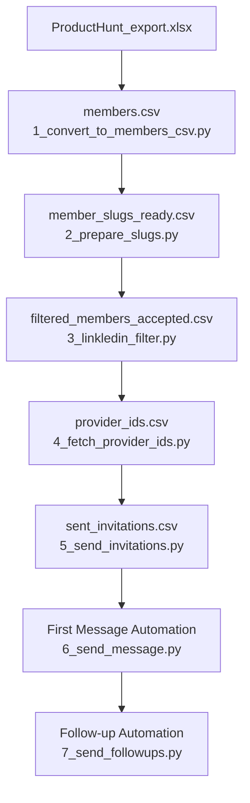

# 🚀 **Unipile LinkedIn Automation Pipeline**

A complete, production-ready automation system for LinkedIn outreach using the **Unipile API**.
It extracts prospects, filters them, sends connection invites, messages new connections, and sends automatic follow-ups — all controlled using a single `config.json`.

Built for **scalability, reliability, and safety**.

---

## 📌 **Features**

* Extracts LinkedIn profiles from messy Excel exports
* Cleans and prepares LinkedIn slugs
* Filters prospects using real LinkedIn data from Unipile
* Fetches provider IDs (required for invites)
* Sends automated connection invitations
* Automatically messages new connections
* Sends follow-up messages after X days
* Fully modular + fully automated pipeline
* Single configuration file (`config.json`)

---

# 🧭 **Table of Contents**

* [Overview](#overview)
* [Pipeline Architecture](#pipeline-architecture)
* [Flowcharts](#flowcharts)
* [Folder Structure](#folder-structure)
* [Installation](#installation)
* [Requirements](#requirements)
* [Configuration (config.json)](#configuration-configjson)
* [Full Pipeline Steps](#full-pipeline-steps)
* [Running the Full Pipeline](#running-the-full-pipeline)
* [Error Handling & Logging](#error-handling--logging)
* [Rate Limiting Behavior](#rate-limiting-behavior)
* [Future Enhancements](#future-enhancements)

---

# 📝 **Overview**

This automation pipeline processes raw Excel exports → extracts LinkedIn profiles → filters them → sends invites → messages new connections → and handles follow-ups automatically.

Every script loads configuration from:

```
config.json
```

No environment variables, no config.py — **one unified config**.

---

# 🏗 **Pipeline Architecture**

## 🔌 ASCII Data Flow

```
 ┌────────────────────────┐
 │ ProductHunt_export.xlsx │
 └───────────┬────────────┘
             ▼
   1_convert_to_members_csv.py
             ▼
       members.csv
             ▼
     2_prepare_slugs.py
             ▼
  member_slugs_ready.csv
             ▼
    3_linkledin_filter.py
             ▼
 ┌───────────────────────────────┐
 │ filtered_members_accepted.csv │
 │ filtered_members_rejected.csv │
 └───────────┬───────────────────┘
             ▼
  4_fetch_provider_ids.py
             ▼
      provider_ids.csv
             ▼
    5_send_invitations.py
             ▼
  sent_invitations.csv
             ▼
    6_send_message.py
             ▼
 Automated Welcome Messages
             ▼
   7_send_followups.py
             ▼
 Automated Follow-ups
```

---

## 🔷 Mermaid Flowchart



---

# 📁 **Folder Structure**

```
Unipile_LinkedIn_Automation/
│
├── config.json
│
├── 1_convert_to_members_csv.py
├── 2_prepare_slugs.py
├── 3_linkledin_filter.py
├── 4_fetch_provider_ids.py
├── 5_send_invitations.py
├── 6_send_message.py
├── 7_send_followups.py
├── run_all.py
│
├── message.txt
├── followup_message.txt
│
├── ProductHunt_export.xlsx
│
├── members.csv
├── member_slugs_ready.csv
├── filtered_members_accepted.csv
├── filtered_members_rejected.csv
├── provider_ids.csv
├── sent_invitations.csv
│
└── README.md
```

---

# ⚙️ **Installation**

### Install required packages:

```sh
pip install -r requirements.txt
```

### Place required input files:

```
ProductHunt_export.xlsx  
message.txt  
followup_message.txt  
```

---

# 📦 **Requirements**

Create a `requirements.txt` with:

```
pandas
requests
python-dateutil
```

(Optional pinned versions):

```
pandas==2.2.2
requests==2.32.3
python-dateutil==2.9.0.post0
```

---

# 🔧 **Configuration (config.json)**

Every script reads this file directly:

```json
{
    "API_KEY": "YOUR_API_KEY",
    "ACCOUNT_ID": "YOUR_ACCOUNT_ID",
    "BASE_URL": "https://api24.unipile.com:15425/api/v1",
    "INVITATION_LIMIT": 30,
    "FOLLOWUP_DAYS": 3
}
```

### ⚠️ **Important Note: BASE_URL**

If your Unipile account uses a different server or endpoint, **update the `BASE_URL`** inside `config.json`.

Example:

```
https://apiXX.unipile.com:XXXXX/api/v1
```

---

# 🚀 **Full Pipeline Steps**

### **1️⃣ Extract LinkedIn URLs**

`1_convert_to_members_csv.py`

* Extracts LinkedIn URLs from any cell
* Output: `members.csv`

---

### **2️⃣ Extract Slugs**

`2_prepare_slugs.py`

* Extracts `/in/username`
* Output: `member_slugs_ready.csv`

---

### **3️⃣ Filter Profiles Using Unipile API**

`3_linkledin_filter.py`

Filters by:

* Real person (not company)
* Country allowed
* Founder/CEO/Director
* Experience ≥ 2
* Followers ≥ 205

Outputs:

* `filtered_members_accepted.csv`
* `filtered_members_rejected.csv`

---

### **4️⃣ Fetch Provider IDs**

`4_fetch_provider_ids.py`

Output:
`provider_ids.csv`

---

### **5️⃣ Send LinkedIn Invitations**

`5_send_invitations.py`

* Random 1–5 min delay between invites
* Output: `sent_invitations.csv`

---

### **6️⃣ Auto-Message New Connections**

`6_send_message.py`

* Only new connections (last X days)
* Only if no chat exists
* Uses `message.txt`
* Logs to terminal + file

---

### **7️⃣ Send Follow-up Messages**

`7_send_followups.py`

* Sends follow-ups after X days
* Uses `followup_message.txt`

---

# ▶️ **Running the Full Pipeline**

```sh
python run_all.py
```

---

# 📊 **Error Handling & Logging**

Logs:

* API failures
* Missing slugs
* 404 profiles
* Rate limit issues
* Message send errors
* Timestamp parse failures

Message automation creates:

```
new_connection_messenger.log
```

---

# ⚠️ **Rate Limiting Behavior**

Built-in delays:

* Profile API calls → 0.5 sec
* Invitations → random 1–5 minutes
* Messages → 1 sec
* Follow-ups → 2 sec

Ensures:

* Account safety
* No API bans
* Natural human-like behavior

---

# 🚀 **Future Enhancements**

* Dashboard UI
* Multi-account rotation
* Smart dynamic messages
* Retry queue
* Database for history
* Automation monitoring system
