# Company Discovery — Architecture & Flow

End-to-end flow of the **Discovery** subtab under Leads in the dashboard. User pastes website
URLs (or LinkedIn company URLs), pipeline resolves them, finds people, verifies current
employment, filters by target titles, returns a preview, and (on demand) appends ACCEPTed rows
to the campaign's leads sheet.

## Stack

| Layer | Tech |
|---|---|
| Frontend | Vanilla JS (inline in `templates/index.html`), `fetch()` |
| Backend | FastAPI on uvicorn (`app.py` on `/home/omni/outreach-dashboard`) |
| Auth | Cookie session via `auth.require_admin` (Depends `_actor`) |
| Service module | `company_discovery_service.py` (self-contained, no `outreach_automation` imports) |
| External — search | Serper.dev (Google) — primary breadth + website-to-LinkedIn resolver |
| External — search | Unipile LinkedIn API — `current_company`-aware people search |
| External — LLM | Anthropic Claude Haiku 4.5 (via `lead_screener.screen_lead`) — title fallback |
| Sheets | gspread + Google service account JSON |
| DB | PostgreSQL (only for `campaign_sheets` + `campaign_linkedin_accounts` lookups, read-only) |

---

## End-to-end sequence

```mermaid
sequenceDiagram
    autonumber
    participant U as User (browser)
    participant JS as Discovery tab JS<br/>(index.html)
    participant API as FastAPI<br/>(app.py)
    participant SVC as company_discovery_service
    participant DB as Postgres<br/>(campaign_sheets,<br/>campaign_linkedin_accounts)
    participant SER as Serper API<br/>google.serper.dev
    participant UNI as Unipile API<br/>api10.unipile.com
    participant LS as lead_screener.<br/>screen_lead
    participant CLA as Anthropic Claude<br/>(haiku-4-5)
    participant GS as Google Sheets<br/>(gspread)

    U->>JS: paste URLs + titles, click Run Discovery
    JS->>API: POST /api/company-discovery/run<br/>{company_urls, titles, campaign_id}
    API->>SVC: run_discovery(...)

    SVC->>SVC: _parse_company_urls()
    loop per input line
        SVC->>SVC: _extract_slug(url)
        alt is linkedin.com/company/<slug>
            SVC->>SVC: use slug directly
        else regular website (e.g. slack.com)
            SVC->>SVC: _resolve_company_from_website(url)
            SVC->>SER: POST /search<br/>q="slack.com site:linkedin.com/company"
            SER-->>SVC: organic[] → first slug
        end
    end
    SVC->>SVC: _parse_titles()

    opt campaign_id provided
        SVC->>DB: SELECT account_id FROM<br/>campaign_linkedin_accounts WHERE campaign_id=…
        DB-->>SVC: account_id
    end

    loop per company
        SVC->>SVC: _search_decision_makers(company, titles, account_id)

        opt UNIPILE_API_KEY + account_id
            SVC->>UNI: POST /api/v1/linkedin/search<br/>{category:"people", current_company:[slug],<br/>keywords: titles, network_distance:[2,3]}
            UNI-->>SVC: items[] → leads with headline + provider_id
        end
        opt SERPER_KEY
            loop per role in titles
                SVC->>SER: POST /search<br/>q="<role> at <slug> site:linkedin.com/in"
                SER-->>SVC: organic[] (title + snippet + link)
                SVC->>SVC: _clean_role_from_title +<br/>_headline_is_generic? → snippet fallback
            end
        end

        SVC->>SVC: dedupe by linkedin_url<br/>(cap MAX_PEOPLE_PER_COMPANY=50)

        loop per raw lead
            SVC->>SVC: _profile_currently_at_company(lead, company)
            note right of SVC: build phrases from slug +<br/>brand from input domain;<br/>reject ex-/former-marker matches
        end

        loop per verified lead
            SVC->>SVC: _keyword_title_filter(headline, titles)
            alt keyword match
                SVC->>SVC: verdict=ACCEPT, method=keyword
            else no keyword match
                opt ANTHROPIC_API_KEY
                    SVC->>LS: screen_lead(lead, prompt)
                    LS->>CLA: POST /v1/messages<br/>(haiku-4-5, prompt-cached)
                    CLA-->>LS: ACCEPT/REJECT + reason
                    LS-->>SVC: verdict, reason
                end
            end
        end
    end

    SVC-->>API: {rows[], stats:{companies, candidates, accepted, rejected}}
    API-->>JS: 200 OK + JSON
    JS->>JS: render results table,<br/>enable Push button if accepted>0

    opt User clicks Push Accepted to Sheet
        JS->>API: POST /api/company-discovery/push<br/>{campaign_id, rows}
        API->>SVC: push_to_sheet(rows, campaign_id)
        SVC->>DB: SELECT leads_sheet_id, leads_tab<br/>FROM campaign_sheets WHERE campaign_id=…
        DB-->>SVC: sheet_id, tab
        SVC->>GS: open_by_key + worksheet
        SVC->>GS: append_rows([accepted rows])<br/>source="company_discovery"
        GS-->>SVC: ack
        SVC-->>API: {pushed, skipped, sheet_id, tab}
        API-->>JS: 200 OK
        JS->>JS: status: "Pushed N accepted rows"
    end
```

---

## Module / function dependency graph

```mermaid
graph TD
    classDef ext fill:#1f2a44,stroke:#5a8dee,color:#fff
    classDef svc fill:#13301f,stroke:#3fa37a,color:#fff
    classDef api fill:#3a1d40,stroke:#a464c1,color:#fff
    classDef ui fill:#3d2f0a,stroke:#d6a847,color:#fff
    classDef db fill:#2b2b2b,stroke:#888,color:#fff

    subgraph Browser
        UI_Tab[Discovery subtab UI]:::ui
        UI_JS[runCompanyDiscovery / pushCompanyDiscovery]:::ui
    end

    subgraph "FastAPI app.py"
        EP_Run["POST /api/company-discovery/run"]:::api
        EP_Push["POST /api/company-discovery/push"]:::api
        DEP_Actor["Depends _actor → require_admin"]:::api
    end

    subgraph "company_discovery_service.py"
        RD[run_discovery]:::svc
        PTS[push_to_sheet]:::svc
        PCU[_parse_company_urls]:::svc
        PT[_parse_titles]:::svc
        ES[_extract_slug]:::svc
        ED[_extract_domain]:::svc
        RFW[_resolve_company_from_website]:::svc
        BFD[_brand_from_domain]:::svc
        SDM[_search_decision_makers]:::svc
        SSP[_search_serper_profiles]:::svc
        SUP[_search_unipile_profiles]:::svc
        CRT[_clean_role_from_title]:::svc
        HIG[_headline_is_generic]:::svc
        ERS[_extract_role_from_snippet]:::svc
        PCAC[_profile_currently_at_company]:::svc
        NCT[_normalize_company_token]:::svc
        KTF[_keyword_title_filter]:::svc
        TIO[_tokens_in_order]:::svc
        NT[_normalize_title]:::svc
        LTS[_llm_title_screen]:::svc
        RCS[_resolve_campaign_sheet]:::svc
        GUA[_get_unipile_account]:::svc
        GW[_get_worksheet]:::svc
        ESH[_ensure_sheet_headers]:::svc
    end

    subgraph "Dashboard infra"
        DB[(Postgres<br/>db.fetch_one)]:::db
        LS[lead_screener.screen_lead]:::svc
        GSP[gspread client<br/>+ service-account JSON]:::svc
    end

    subgraph "External APIs"
        SER[Serper /search<br/>google.serper.dev]:::ext
        UNI[Unipile /api/v1/linkedin/search<br/>api10.unipile.com]:::ext
        CLA[Anthropic /v1/messages<br/>claude-haiku-4-5]:::ext
        GSAPI[Google Sheets API]:::ext
    end

    UI_Tab --> UI_JS
    UI_JS --> EP_Run
    UI_JS --> EP_Push
    EP_Run --> DEP_Actor
    EP_Push --> DEP_Actor
    EP_Run --> RD
    EP_Push --> PTS

    RD --> PCU
    RD --> PT
    RD --> GUA
    RD --> SDM
    RD --> PCAC
    RD --> KTF
    RD --> LTS

    PCU --> ES
    PCU --> RFW
    RFW --> ED
    RFW --> SER
    RFW --> ES

    SDM --> SUP
    SDM --> SSP
    SUP --> UNI
    SSP --> SER
    SSP --> CRT
    SSP --> HIG
    SSP --> ERS

    PCAC --> NCT
    PCAC --> BFD

    KTF --> NT
    KTF --> TIO
    LTS --> LS
    LS --> CLA

    GUA --> DB

    PTS --> RCS
    PTS --> GW
    PTS --> ESH
    RCS --> DB
    GW --> GSP
    ESH --> GSP
    GSP --> GSAPI
```



---

## REST API surface (this feature)

| Method | Path | Body | Returns | Auth |
|---|---|---|---|---|
| `POST` | `/api/company-discovery/run` | `{company_urls: str, titles: str, campaign_id?: str}` | `{rows: [...], stats: {companies, candidates, accepted, rejected}}` | session cookie |
| `POST` | `/api/company-discovery/push` | `{campaign_id: str, rows: [...]}` | `{pushed: int, skipped: int, sheet_id, tab}` | session cookie |

## Outbound calls (per Run)

| Target | Method | Endpoint | When |
|---|---|---|---|
| Serper | POST | `https://google.serper.dev/search` | (a) once per non-LinkedIn input URL to resolve to a LinkedIn company; (b) once per (company × title) combination for breadth |
| Unipile | POST | `${UNIPILE_BASE}/api/v1/linkedin/search` | once per company when an account_id is available |
| Anthropic | POST | `https://api.anthropic.com/v1/messages` | per candidate when keyword title filter doesn't match (and `ANTHROPIC_API_KEY` is set) |
| Postgres | SELECT | `campaign_linkedin_accounts`, `campaign_sheets` | once per run for account lookup; once per push for sheet lookup |
| Google Sheets | POST | `spreadsheets.values.append` | only on Push, once per campaign sheet |

## Caps & limits

| Constant | Value | Where |
|---|---|---|
| `MAX_COMPANIES_PER_RUN` | 25 | request-level |
| `MAX_PEOPLE_PER_COMPANY` | 50 | per-company candidate cap |
| `SERPER_MAX_RETRIES` | 3 | per Serper query (429 backoff) |
| `SERPER_SEARCH_DELAY` | 1.0 s | between Serper queries |
| Claude `max_tokens` | 80 | per screening call |

## Live verification snapshot (today)

| Input | Resolved slug | Candidates | Accepted |
|---|---|---|---|
| `stripe.com` | `stripe` | 14 | 2 |
| `figma.com` | `figma` | 24 | 3 |
| `notion.so` | `notionhq` | 9 | 2 |
| `vercel.com` | `vercel` | 17 | 1 |
| `linear.app` | `linear` | 14 | 1 |
| `slack.com` | `tiny-spec-inc` | 2 | 1 (Slack CEO) |
